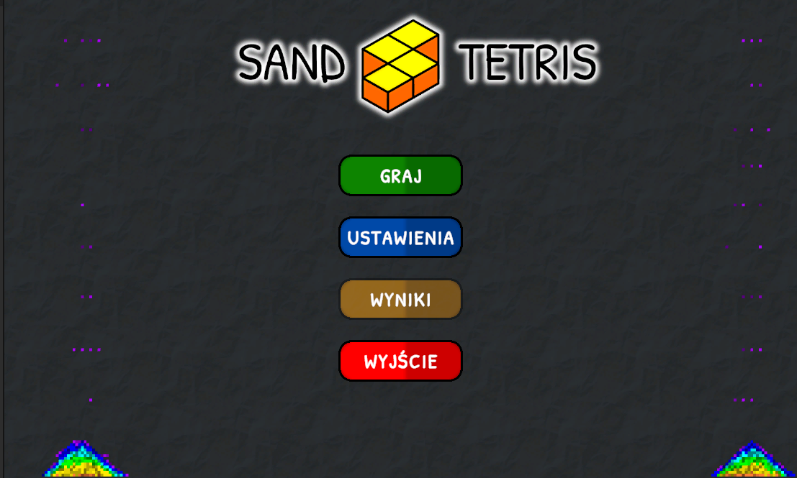
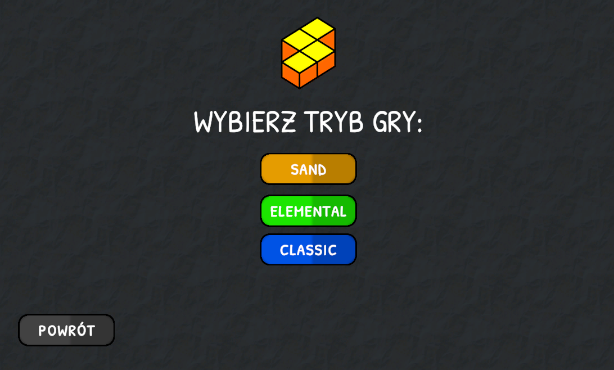
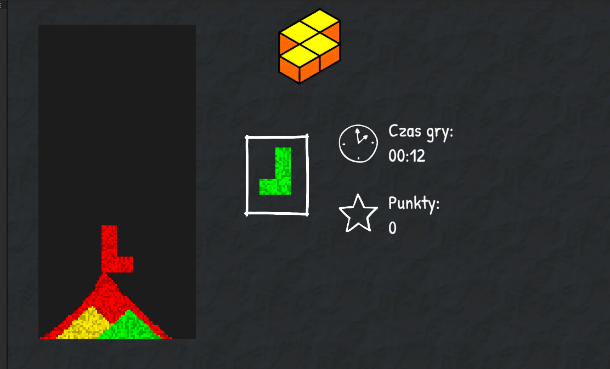
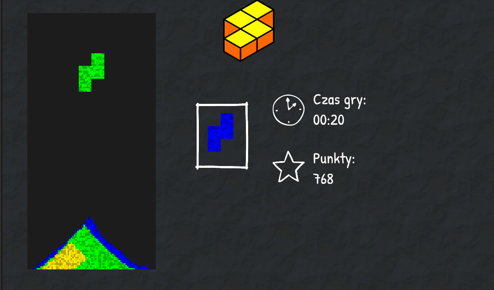
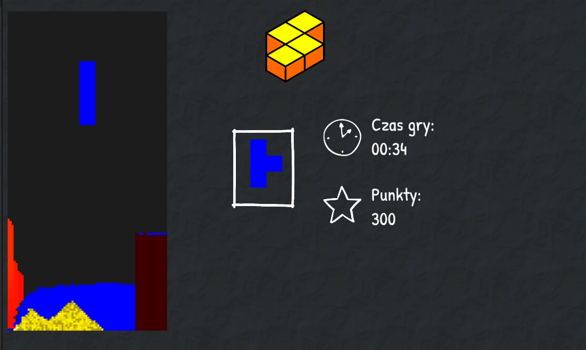
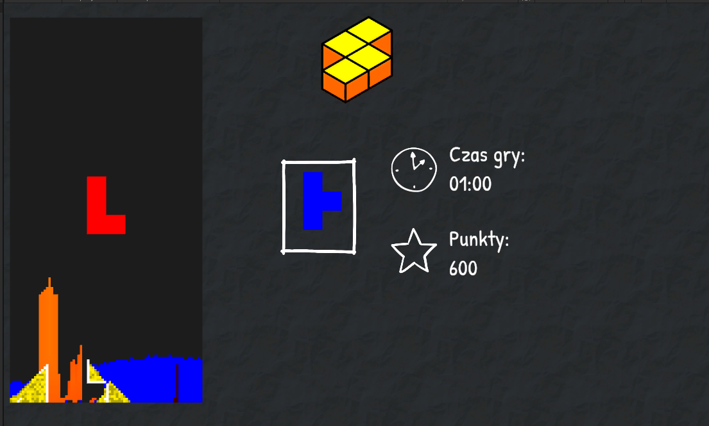
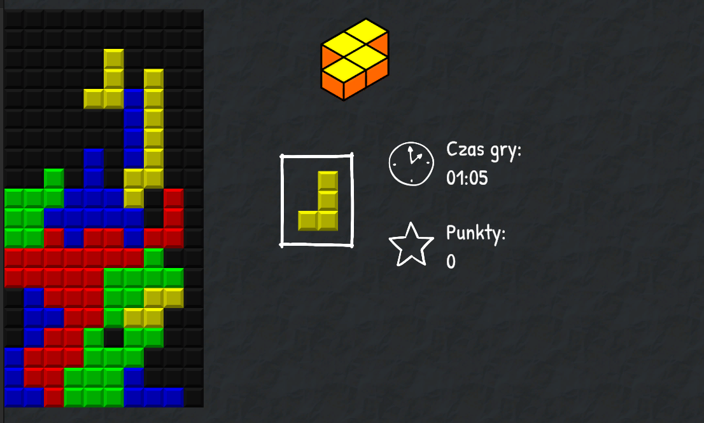

## Opis

Projekt ma na celu implementacje kultowej gry tertis z dodatkowymi trybami.

# Tryby

## Sand

Jest to implementacja trybu gry, który opiera się na ziarnkach piasku. Ziarna piasku znikają, gdy dany kolor utworzy ciągłą ścieżkę od lewej do prawej ściany.

## Elemental

Jest to implementacja trybu gry, który opiera się na mechanice niszczenia poszczególnych elementów, podobnej do zasady "papier, kamień, nożyce".

## Classic

Jest to implementacja standardowego trybu gry tetrisa.

